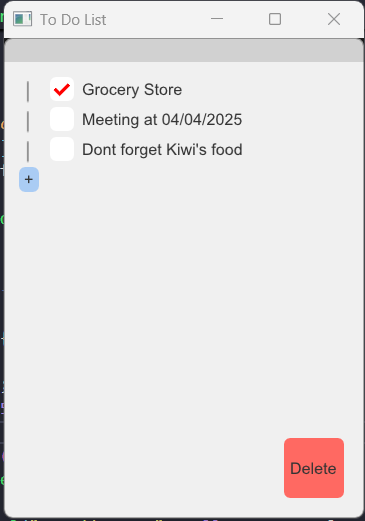
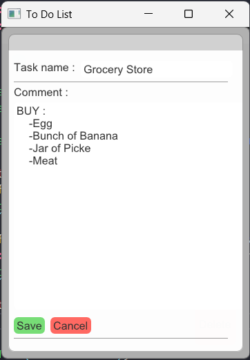

# To Do List App
This is a small To-Do List application built using C++, Dear ImGui, CMake, and vcpkg. The app provides a simple and user-friendly graphical interface to add, edit, and delete tasks easily.
## How the UI look like



## Features
- Add new task
- Edit existing task names and comments
- Delete Task
## Tech Stack
- Language C++
- GUI Framework: [Dear ImGui](https://github.com/ocornut/imgui.git) with backend of glfw_opengl3
- Build system Cmake
- Package manager [vcpkg](https://github.com/microsoft/vcpkg.git)
- Compiler: Clang/GCC/MSVC
## Getting Started
```cmd
git clone git@github.com:Emre-Yesil/to-do-list-imgui.git
cd to-do-list-imgui
.\vcpkg\bootstrap-vcpkg.bat # windows
./vcpkg/bootstrap-vcpkg.sh # Unix
```
## Credits
- Template and setup inspired by [franneck94](https://github.com/franneck94/UdemyCppGui.git)

